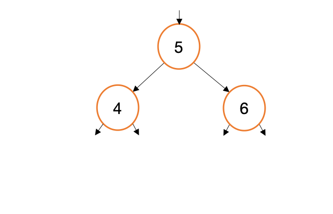
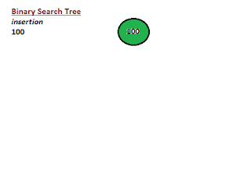
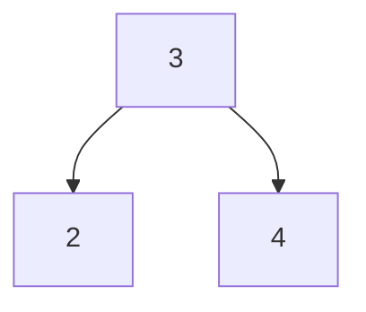

# Laboratorio - Árboles de búsqueda binaria (Parte01)

Para esta tarea, explorarás cómo escribir un árbol de búsqueda binaria, junto con algunas
Funciones de utilidad para el árbol. También explorarás el concepto de
recursividad y cómo se puede utilizar para simplificar el código.

## Archivos proporcionados
Este proyecto tiene varios archivos proporcionados. Dividimos el código de "implementación" para que
parezca más a un programa C estándar. Los archivos que proporcionamos son:

* [my_bst.h](my_bst.h) - Este es el archivo de encabezado de su BST. Contiene los prototipos de funciones para las funciones que implementará.
* [my_bst.c](my_bst.c) - Este es el archivo de implementación para su BST. Contiene las definiciones de funciones para las funciones que implementará relacionadas con la **estructura** del bst.
* [my_bst_printer.c](my_bst_printer.c) - Este es el archivo de implementación para imprimir BST. Contiene las definiciones de funciones que implementará relacionadas con **imprimir** el bst.
* [bst_main.c](bst_main.c) - Este es el archivo principal de su BST. Contiene la función principal y el código para probar su bst. Debe agregar sus pruebas a este archivo y ejecutarlo para probar su bst.
 
👉🏽 **Tarea** 👈🏽 Tómate el tiempo para revisar los archivos. Deberían compilarse sin modificaciones en este punto. 


## Árbol de búsqueda binaria (BST)
Como recordatorio, en un BST, el hijo izquierdo de un nodo siempre es menor que el padre y el hijo derecho siempre es mayor que el padre. Esto le permite buscar en el árbol en tiempo O(log n), que es mucho más rápido que una lista enlazada.

Si bien técnicamente solo necesitas un nodo para crear un árbol completo, en este laboratorio usamos dos estructuras proporcionadas.

```c
typedef struct Node
{
    int data;            
    struct Node *left;  
    struct Node *right; 
} Node;


typedef struct tree
{
    unsigned int size;  
    Node *root;
} BST;
```

En su mayor parte, BST es lo que está "expuesto" al resto del programa, pero las funciones que manipulan el árbol directamente lo harán.
Lo más probable es que sean funciones auxiliares que no están expuestas al resto del programa. 

👉🏽 **Tarea** 👈🏽 Cada función tiene comentarios encima que documentan lo que hace, su tarea es implementar completamente todo lo proporcionado, mientras agrega funciones auxiliares adicionales según sea necesario.

### Entendiendo BST

Puede resultar útil echar un vistazo a algunas animaciones sobre cómo implementar cada una de las operaciones. También asegúrese de consultar los recursos para obtener un enlace a un BST interactivo.

#### bst_add
<center>



</center>


Para la función bst_add, recorrerá el árbol. A medida que recorra, comparará el elemento actual que está iterando con el elemento que le gustaría agregar. Si es menor o igual que el elemento actual, te moverás hacia la izquierda. Si es mayor, te moverás hacia la derecha. Si es igual, no lo agregará, según nuestra definición de que no debe haber duplicados en el árbol.

Existe un caso extremo en el que el primer nodo que agregue a un árbol se convertirá en la raíz.

Aquí hay otro ejemplo de construcción de un árbol de búsqueda binaria.

<center>



</center>

### Implementaciones de funciones

Le sugerimos implementar las siguientes funciones en el siguiente orden:
* crear_bst
* bst_free - Piensa en qué recorrido DFS usarías para liberar el árbol.
* bst_add
* Luego sus diversas funciones de impresión.


Recuerde, el más simple árbol  suele ser 3, 2, 4, lo que generaría el siguiente árbol:<center>



</center>


## 📚 Recursos
* [Binary Search Tree](https://en.wikipedia.org/wiki/Binary_search_tree)
* [Visual Go](https://visualgo.net/en/bst)
* [Geeks for Geeks Binary Search Tree](https://www.geeksforgeeks.org/binary-search-tree-data-structure/)
* [Program Wiz BST](https://www.programiz.com/dsa/binary-search-tree)


