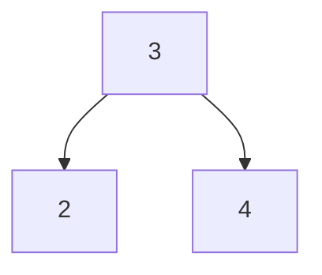

# Laboratorio - Árboles de búsqueda binaria (Parte01)

Para esta tarea, explorarás cómo escribir un árbol de búsqueda binaria, junto con algunas
Funciones de utilidad para el árbol. También explorarás el concepto de
recursividad y cómo se puede utilizar para simplificar el código.

## Archivos proporcionados
Este proyecto tiene varios archivos proporcionados. Dividimos el código de "implementación" para que
parezca más a un programa C estándar. Los archivos que proporcionamos son:

* [my_bst.h](../my_bst.h) - This is the header file for your bst.  It contains the function prototypes for the functions you will implement.
* [my_bst.c](../my_bst.c) - This is the implementation file for your bst.  It contains the function definitions for the functions you will implement related to the **structure** of the bst.
* [my_bst_printer.c](../my_bst_printer.c) - This is the implementation file for your bst printer.  It contains the function definitions for the functions you will implement related to **printing** the bst. Most of this code can be copied from Lab 10 with minor modifications.
* [my_bst_util.h](../my_bst_util.h) - This is the header file for your bst utility functions.  It contains the function prototypes for the functions you will implement related to **utility** functions for the bst, such as `sum`, `min`, and `max`.
* [my_bst_util.c](../my_bst_util.c) - This is the implementation file for your bst utility functions.  It contains the function definitions for the functions you will implement related to **utility** functions for the bst, such as sum, min, and max.
* [bst_main.c](../bst_main.c) - This is the main file for your bst.  It contains the main function, and the code to test your bst.  You should add your tests to this file, and run it to test your bst.
* [Makefile](../Makefile) - This is the makefile for your program. You should not need to modify this file, but you should look at it to see how it compiles all the files. As a reminder from the lab, to build your program, use "make" in the directory with the Makefile.  To clean up your directory, use "make clean".


 
👉🏽 **Tarea** 👈🏽 Tómate el tiempo para revisar los archivos. Deberían compilarse sin modificaciones en este punto. Querrá realizar este proyecto en pasos, así que mientras revisa los archivos, asegúrese de planificar su enfoque para construir el BST.


## Árbol de búsqueda binaria (BST)
Como recordatorio, en un BST, el hijo izquierdo de un nodo siempre es menor que el padre y el hijo derecho siempre es mayor que el padre. Esto le permite buscar en el árbol en tiempo O(log n), que es mucho más rápido que una lista vinculada.

Si bien técnicamente solo necesitas un nodo para crear un árbol completo, en este laboratorio usamos dos estructuras proporcionadas.

```c
typedef struct Node
{
    int data;            
    struct Node *left;  
    struct Node *right; 
} Node;


typedef struct tree
{
    unsigned int size;  
    Node *root;
} BST;
```

En su mayor parte, BST es lo que está "expuesto" al resto del programa, pero las funciones que manipulan el árbol directamente lo harán.
Lo más probable es que sean funciones auxiliares que no están expuestas al resto del programa. Por ejemplo, cuando usted
llame a `bst_add`, puede llamar a `bst_add_helper` para realizar el trabajo real de agregar el nodo al árbol más allá del nodo raíz. Este es un patrón común.


👉🏽 **Task** 👈🏽 Each function has comments above it documenting what it does, your task is to fully implement every provided
function, while adding additional helper functions as you need.

### Entendiendo BST

Puede resultar útil echar un vistazo a algunas animaciones sobre cómo implementar cada una de las operaciones. También asegúrese de consultar los recursos para obtener un enlace a un BST interactivo.

#### bst_add
<center>


</center>

For the add operation, you will be traversing the tree. As you traverse, you will compare the current element you are iterating with the element you would like to add. If it is less than or equal to the current element, you will move left. If it is greater, than you will move right. If it is equal, you won't add it, based on our definition that there should be no duplicates in the tree.

There is an edge case that the very first node you add to a tree will become the root.

Here is another sample construction of a binary search tree tree.

Para la función bst_add, atravesará el árbol. A medida que recorra, comparará el elemento actual que está iterando con el elemento que le gustaría agregar. Si es menor o igual que el elemento actual, te moverás hacia la izquierda. Si es mayor, te moverás hacia la derecha. Si es igual, no lo agregará, según nuestra definición de que no debe haber duplicados en el árbol.

Existe un caso extremo en el que el primer nodo que agregue a un árbol se convertirá en la raíz.

Aquí hay otro ejemplo de construcción de un árbol de búsqueda binaria.

<center>


</center>

### Function Implementations

We suggest you implement the following functions in the following order:
* create_bst
* bst_free - Think about what DFS traversal you would use to free the tree
* bst_add
* Then your various print functions. 

This will allow you to create a tree, and print it out to make sure it is working correctly. You will ideally want to draw out the tree you are adding, but if you are having trouble, you can use a [BST Visualizer](https://www.cs.usfca.edu/~galles/visualization/BST.html) to help you visualize the tree.

Remember, the simplest that has multiple nodes is often 3, 2, 4 which would generate the following tree:
<center>



</center>

You can then look at your exists (equivalent to find/search), and size functions to make sure they are working correctly. The utility functions (sum, max, min) are also good functions to work on once you get the tree working. We have provided
some ideas of what to test for in [bst_main.c](../bst_main.c). You should add your own tests to this file, and run it to test your bst.

Above all **focus on simplicity**. Many BST functions are only a few lines outside of the NULL checks. Also, don't forget we provided the solution to the lab for printing the tree, so you can use that as a reference, along with other references you find. 

## 📝 Grading Rubric

We will use the following grading rubric to grade your assignment.


1. Learning (AG)
   * bst_add correctly adds in some simple bst configurations
   * bst exists correctly returns true for some simple bst configurations
   * bst size correctly returns the size of some simple bst configurations
   * bst is empty correctly returns true for some simple bst configurations
2. Approaching  (AG)
   *  bst_add correctly adds in some more complex bst configurations
   *  bst exists correctly returns true or false for some more complex bst configurations
   *  bst size correctly returns the size of some more complex bst configurations
3. Meets  (AG)
   *  sum works for a variety of bst configurations
   *  min works for a variety of bst configurations
   *  max works for a variety of bst configurations
   *  print inorder, postorder, and preorder work for a simple bst configuration
4. Exceeds  (MG)  
   * Reviews code for comments, style, and properly completed functions (including free)
   * Uses recursive add, find, and free
   * All questions in README.md answered correctly


AG - Auto-graded  
MG - Manually graded


## 📚 Recursos
* [Binary Search Tree](https://en.wikipedia.org/wiki/Binary_search_tree)
* [Visual Go](https://visualgo.net/en/bst)
* [Geeks for Geeks Binary Search Tree](https://www.geeksforgeeks.org/binary-search-tree-data-structure/)
* [Program Wiz BST](https://www.programiz.com/dsa/binary-search-tree)


